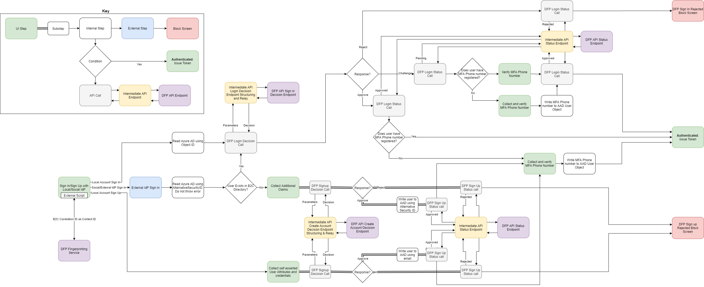

# Introduction

Microsoft Dynamics 365 Fraud Protection Account Protection provides clients the capability to assess if the risk of attempts to create new accounts and attempts to login on client’s ecosystem are fraudulent. DFP assessment in Fraud Protection can be used by the customer to block or challenge suspicious attempts to create new fake accounts or to compromise existing accounts. Account protection includes artificial intelligence empowered device fingerprinting, APIs for real-time risk assessment, rule and list experience to optimize risk strategy as per client’s business needs, and a scorecard to monitor fraud protection effectiveness and trends in client’s ecosystem.

In this sample, we will be demonstrating the account protection features of
Dynamics365 Fraud Protection by integrating it with an Azure AD B2C user flow. The
service will externally fingerprint every sign in or sign up attempt and watch for
any past or present suspicious behaviour. Before completing the process, client
application (in this case, Azure AD B2C) invokes a decision endpoint from DFP
which returns a result based on all past and present behaviour from the identified
user, as well as custom rules you have specified within the DFP service. The
client application is then expected to base it's approval decision based on this
result and pass the same back to DFP.

# Solution Components

Following are the parts of this demo:

- **Azure AD B2C Tenant**: The "client application" that we will be monitoring
    with DFP. Hosts a fingerprinting script collecting identification and
    diagnostic data of every user that hits a target policy(e.g. IP Address etc...)
    Subsequently blocks or challenges sign in or sign up attempts if DFP finds
    them suspicious

- **Custom App Service**: This is a dotnet web application that serves two
    purposes. Serving HTML pages to be used as IdentityExperienceFramework's UI,
    actively embedding and accomodating the fingerprinting script and an API
    controller with RESTful endpoints connecting DFP to B2C, handling data
    processing, structuring, and adhering to the security requirements of both.

- **DFP Fingerprinting Service**: Dynamically embedded script which logs device
    telemetry and self asserted user details to create a uniquely
    identifiable fingerprint for the user. This will later be used in the decision
    making process.

- **DFP API Endpoints**: Provides the decision result and also accepts a final
    status reflecting the operation undertaken by the client application. Azure
    AD B2C does not communicate with the endpoints directly due to varying
    security and structure requirements, instead using the app service as an
    intermediate

## Workflow

DFP process flow

## Setting Up the Solution

### Registering a Facebook app

Follow [these instructions](https://docs.microsoft.com/en-us/azure/active-directory-b2c/identity-provider-facebook#create-a-facebook-application) to create a Facebook application configured to allow federation to Azure AD B2C. After this, follow [these instructions](https://docs.microsoft.com/en-us/azure/active-directory-b2c/custom-policy-get-started#create-the-facebook-key) to add the Facebook secret you created as an Identity Experience Framework Policy Key

### Configuring your tenant for Dynamics365 Fraud Protection

Follow [these instructions](https://docs.microsoft.com/en-us/dynamics365/fraud-protection/integrate-real-time-api) to set up your tenant to use DFP real-time APIs

### Deploy the API

Deploy the provided API code to an Azure service. The code can be
published from Visual Studio, following these [instructions](https://docs.microsoft.com/visualstudio/deployment/quickstart-deploy-to-azure?view=vs-2019).

Set-up CORS, add Allowed Origin `https://{your_tenant_name}.b2clogin.com`

Note the URL of the deployed service. We will need this later to
configure this later to configure Azure AD with the required settings.

#### Adding context dependent configuration settings

Application settings can be [configured in the App service in
Azure](https://docs.microsoft.com/en-us/azure/app-service/configure-common#configure-app-settings).
This allows for settings to be securely configured without checking them
into a repository. The Rest API needs the following settings provided:

|              **Application Setting Name**              |                                                 **Source/Value**                                                 |                               **Notes**                                |
| ------------------------------------------------------ | ---------------------------------------------------------------------------------------------------------------- | ---------------------------------------------------------------------- |
| FraudProtectionSettings:InstanceId                     | DFP Configuration                                                                                                |                                                                        |
| FraudProtectionSettings:DeviceFingerprintingCustomerId | Your Microsoft device fingerprinting customer ID                                                                 |                                                                        |
| FraudProtectionSettings:ApiBaseUrl                     | Your Base URL from DFP Portal                                                                                    | Remove '-int' to call the production API instead                       |
| TokenProviderConfig:Resource                           | https://api.dfp.dynamics-int.com                                                                                 | Remove '-int' to call the production API instead                       |
| TokenProviderConfig:ClientId                           | Your Fraud Protection merchant Azure Active Directory client app ID                                              |                                                                        |
| TokenProviderConfig:Authority                          | https://login.microsoftonline.com/<directory_ID>                                                                 | Your Fraud Protection merchant Azure Active Directory tenant authority |
| TokenProviderConfig:CertificateThumbprint*             | The thumbprint of the certificate to use to authenticate against your merchant Azure Active Directory client app |                                                                        |
| TokenProviderConfig:ClientSecret*                      | The secret for your merchant Azure Active Directory client app                                                   | Recommended to use a secrets manager                                   |

*Only set 1 of the 2 marked parameters depending on if you authenticate with a certificate or a secret (password).

### Azure AD B2C Configuration

#### Replace the configuration values

In the provided custom policies, find the following placeholders and
replace with the corresponding values from your instance

Placeholder| Replace with | Example
-----------|--------------|--------------
{your_tenant_name}|Your tenant short name|“yourtenant” from yourtenant.onmicrosoft.com
{your_tenantId}|Tenant Id of your B2C tenant|01234567-89ab-cdef-0123-456789abcdef
{your_tenant_IdentityExperienceFramework_appid}|App Id of the IdentityExperienceFramework app configured in your B2C tenant|01234567-89ab-cdef-0123-456789abcdef
{your_tenant_ ProxyIdentityExperienceFramework _appid}|App Id of the ProxyIdentityExperienceFramework app configured in your B2C tenant|01234567-89ab-cdef-0123-456789abcdef
{your_tenant_extensions_appid}|App Id of your tenant’s storage application|01234567-89ab-cdef-0123-456789abcdef
{your_tenant_extensions_app_objectid}|Object Id of your tenant’s storage application|01234567-89ab-cdef-0123-456789abcdef
{your_app_insights_instrumentation_key}|Instrumentation key of your app insights instance*|01234567-89ab-cdef-0123-456789abcdef
{your_ui_base_url}|Endpoint in your app service from where your UI files are served|https://yourapp.azurewebsites.net/B2CUI/GetUIPage
{your_app_service_url}|URL of your app service|https://yourapp.azurewebsites.net
{your-facebook-app-id}|App id of the facebook app you configured for federation with B2C|000000000000000
{your-facebook-app-secret}|Name of the policy key you've saved facebook's app secret as|B2C_1A_FacebookAppSecret

\*App insights can be in a different tenant. This step is optional.
Remove the corresponding TechnicalProfiles and OrechestrationSteps if
not needed

#### Configure the B2C Tenant

For instructions on how to set up your b2c tenant and configure policies, visit [this
documentation](https://docs.microsoft.com/en-us/azure/active-directory-b2c/custom-policy-get-started?tabs=applications#custom-policy-starter-pack).

As a best practice, we recommend that customers add consent notification in the attribute collection page. 
Notify users telemetry and user identity information will be recorded for account protection purposes.
