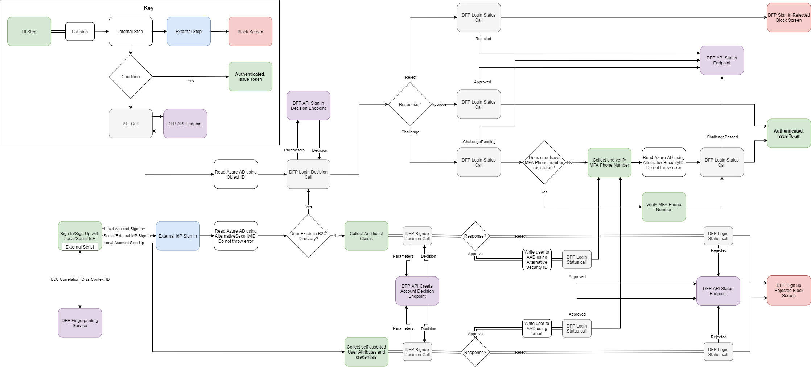

# Introduction

Microsoft Dynamics 365 Fraud Protection (DFP) Account Protection provides organizations with the capability to assess if the risk of attempts to create new accounts and attempts to login on to the organization's ecosystem are fraudulent. DFP account protection can be used to block or challenge suspicious attempts to create new fake accounts or to compromise existing accounts.

This sample demonstrates how to incoporate the DFP device fingerprinting and acount creation and sign-in assessment API endpoints into an Azure AD B2C custom policy.

# Solution Components

The following compontents are the parts of this sample:

- **Azure AD B2C Tenant**: Azure AD B2C integrates the DFP fingerprinting script which collects
    device profiling information for every user that authenticates via a target Azure AD B2C policy.
    Azure AD B2C subsequently blocks or challenges sign in or sign up attempts based on the rule
    evaluation result returned by DFP.

- **Custom UI Templates**: These UI templates are used to customize the HTML content of the pages
    rendered by Azure AD B2C. These pages include the JavaScript snippet required for DFP fingerprinting.

- **DFP Fingerprinting Service**: This is a JavaScript snippet embedded in the Azure AD B2C
    UI template pages which logs device profile information create a uniquely
    identifiable fingerprint for the user. This will later be used in the DFP risk
    evaluation process.

- **DFP API Endpoints**: Provides the decision result and also accepts a final
    status reflecting the operation undertaken by the client application. Azure
    AD B2C communicates directly with the DFP endpoints using REST API connectors.
    API authentication occurs via a client_credentials grant to the Azure AD tenant
    in which DFP is licensed and installed to obtain a bearer token.

## Workflow Overview

## Setting Up the Solution

### Prerequisites

In order to setup this policy, you should have a good working knowledge of custom policies, UI customization, and REST API conections in Azure AD B2C.

### Registering a Facebook app

Follow [these instructions](https://docs.microsoft.com/en-us/azure/active-directory-b2c/identity-provider-facebook#create-a-facebook-application) to create a Facebook application configured to allow federation to Azure AD B2C. After this, follow [these instructions](https://docs.microsoft.com/en-us/azure/active-directory-b2c/custom-policy-get-started#create-the-facebook-key) to add the Facebook secret you created as an Identity Experience Framework Policy Key

### Setting up Dynamics 365 Fraud Protection

Follow [these instructions](https://docs.microsoft.com/en-us/dynamics365/fraud-protection/integrate-real-time-api) to setup the DFP real-time APIs.

### Custom domain setup requirements

In a production environment, you must use a custom domain for Azure AD B2C and for the DFP fingerprinting service. The domain for both services should reside in the same root DNS zone prevent browser privacy settings from blocking cross-domain cookies. This is not necessary in a non-production environment.

For example:
| Environment       | Service               | Domain                    |
| --                | --                    | --                        |
| Development       | Azure AD B2C          | contoso-dev.b2clogin.com  |
| Development       | DFP Fingerprinting    | fpt.dfp.microsoft-int.com |
| UAT               | Azure AD B2C          | contoso-uat.b2clogin.com  |
| UAT               | DFP Fingerprinting    | fpt.dfp.microsoft.com     |
| Production        | Azure AD B2C          | login.contoso.com         |
| Production        | DFP Fingerprinting    | fpt.login.contoso.com     |

Follow [these instructions](https://docs.microsoft.com/en-us/azure/active-directory-b2c/custom-domain?pivots=b2c-custom-policy) to setup a custom domain in Azure AD B2C.
Follow [these instructions](https://docs.microsoft.com/en-us/dynamics365/fraud-protection/device-fingerprinting#set-up-dns) to setup a custom domain for the DFP fingerprinting service.

### Deploy the UI templates

Deploy the provided Azure AD B2C UI templates from the [`ui-templates`](./ui-templates/) folder to a public internet facing hosting service such as Azure Blob Storage.

Before deploying, you should perform a find & replace operation in the UI files to replace the value `https://<YOUR-UI-BASE-URL>/` with the root URL for your deployment location. Also note the base URL as it will be required for the configuration of your Azure AD B2C policies.

Reference [these instructions](https://docs.microsoft.com/en-us/azure/active-directory-b2c/customize-ui-with-html?pivots=b2c-custom-policy) for more information about UI customization. Ensure CORS is enabled for your Azure AD B2C domain name (i.e.: `https://{your_tenant_name}.b2clogin.com` or your custom domain).

### Azure AD B2C Configuration

#### Add policy keys for your DFP client app ID and secret

In the Azure AD tenant where Dynamics Fraud Protection is setup, create an Azure AD application and grant admin consent for the `` scope. For more information see [this documenation page](https://docs.microsoft.com/en-us/dynamics365/fraud-protection/integrate-real-time-api#create-azure-active-directory-applications).

Create an secret value for this application registration and note the application's client ID and client secret value.

Save the client ID and client secret values as policy keys in your Azure AD B2C tenant. Note the policy keys as you will need them when you configure your Azure AD B2C policies. For more information, see [this documentation page](https://docs.microsoft.com/en-us/azure/active-directory-b2c/policy-keys-overview).

#### Replace the configuration values

In the provided custom policies in the [`policies`](./policies/) folder, find the following placeholders and replace with the corresponding values from your instance

| Placeholder | Replace with | Example |
| -- | -- | -- |
| {Settings:Production} | Whether to deploy the policies in production mode | `true` or `false` |
| {Settings:Tenant} | Your tenant short name | `your-tenant` (from your-tenant.onmicrosoft.com)
| {Settings:DeploymentMode} | Which Application Insights deployment mode to use | `Production` or `Development`
| {Settings:DeveloperMode} | Whether to deploy the policies in Application Insights developer mode | `true` or `false` |
| {Settings:AppInsightsInstrumentationKey} | Instrumentation key of your Application Insights instance* | `01234567-89ab-cdef-0123-456789abcdef` |
| {Settings:IdentityExperienceFrameworkAppId} | App Id of the IdentityExperienceFramework app configured in your Azure AD B2C tenant | `01234567-89ab-cdef-0123-456789abcdef` |
| {Settings:ProxyIdentityExperienceFrameworkAppId} | App Id of the ProxyIdentityExperienceFramework app configured in your Azure AD B2C tenant | `01234567-89ab-cdef-0123-456789abcdef` |
| {Settings:FacebookClientId} | App id of the Facebook app you configured for federation with B2C | `000000000000000` |
| {Settings:FacebookClientSecretKeyContainer} | Name of the policy key in which you saved Facebook's app secret | `B2C_1A_FacebookAppSecret` |
| {Settings:ContentDefinitionBaseUri} | Endpoint in where you deployed the UI files | `https://<my-storage-account>.blob.core.windows.net/<my-storage-container>` |
| {Settings:DfpApiBaseUrl} | The base path for your DFP API instace - this can be found in the DFP portal | `https://tenantname-01234567-89ab-cdef-0123-456789abcdef.api.dfp.dynamics.com/v1.0/` |
| {Settings:DfpApiAuthScope} | The client_credentials scope for the DFP API service | `https://api.dfp.dynamics-int.com/.default` or `https://api.dfp.dynamics.com/.default` |
| {Settings:DfpTenantId} | The ID of the Azure AD tenant (not B2C) where DFP is licensed and installed | `01234567-89ab-cdef-0123-456789abcdef` or `consoto.onmicrosoft.com` |
| {Settings:DfpAppClientIdKeyContainer} | Name of the policy key in which you save the DFP client ID  | `B2C_1A_DFPClientId` |
| {Settings:DfpAppClientSecretKeyContainer} | Name of the policy key in which you save the DFP client secret | `B2C_1A_DFPClientSecret` |

_\*Application Insights can be setup in any Azure AD tenant/subscription. This value is optional but recommended to assist with debugging. See [this documentation page](https://docs.microsoft.com/en-us/azure/active-directory-b2c/troubleshoot-with-application-insights) for more information._

#### Configure the Azure AD B2C Tenant

For instructions on how to set up your Azure AD B2C tenant and configure policies, visit [this
documentation page](https://docs.microsoft.com/en-us/azure/active-directory-b2c/custom-policy-get-started?tabs=applications#custom-policy-starter-pack).

**Note:** As a best practice, we recommend that customers add consent notification in the attribute collection page. 
You should notify users that device telemetry and user identity information will be recorded for account protection purposes in accordance with local regulations. _The UI templates provided in this sample DO NOT include this notification._