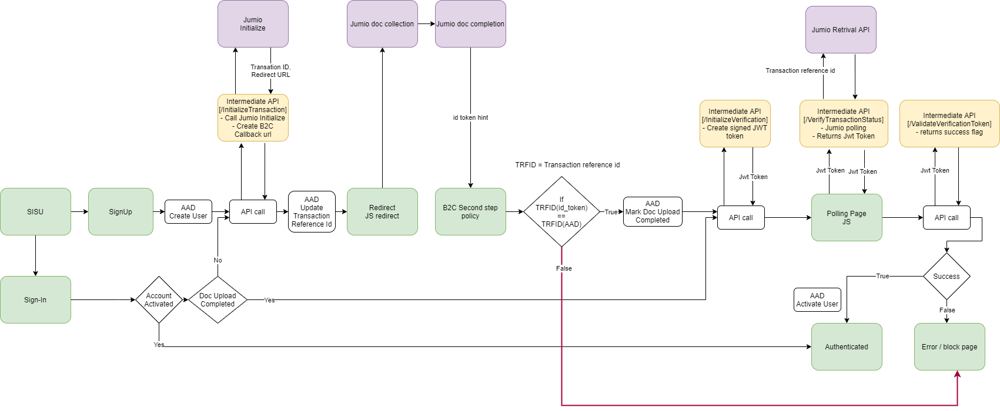

Jumio Integration
=================

The Jumio enables real-time automated ID verification, safeguarding customer data. Here, we integrating Jumio ID verification service and Azure AD B2C with the help of an Intermediate REST API Service.

Solution Components
-------------------

The Jumio integration is comprised of the following components:

-   Azure AD B2C Tenant-- The authorization server, responsible for verifying the user's credentials using the custom policies defined in the tenant. It is also known as the identity provider.

-   Jumio -- The Jumio service takes the ID details provided by the user and verifies it.

-   Intermediate Rest API -- This provided API implements the integration between Azure AD B2C and the Jumio service.

-   Blob Storage - To supply custom UI files to the B2C policies.

Workflow
----------------------

Set Up a Jumio Account
----------------------

Get a netverify account from Jumio and set up API credentials for Basic Authentication. We may need it in the later section.

Deploy the API
--------------

Deploy the provided API code to Azure app service. The code can be published from Visual Studio, following these [instructions].

Note the URL of the deployed service. This will be needed to configure Azure AD with the required settings.

### Create a self-signed certificate

Before configuring the applications, you need to create a self-signed certificate using the PowerShell. And, upload the certificate to the azure app service.

Sample code for creating a self-signed certificate using Powershell:

    $cert = New-SelfSignedCertificate -Type Custom -Subject "CN=Demo-SigningCertificate" -TextExtension @("2.5.29.37={text}1.3.6.1.5.5.7.3.3") -KeyUsage DigitalSignature -KeyAlgorithm RSA -KeyLength 2048 -NotAfter (Get-Date).AddYears(2) -CertStoreLocation "Cert:\CurrentUser\My"
    $cert.Thumbprint
    $pwdText = "Your password"
    $pwd = ConvertTo-SecureString -String $pwdText -Force -AsPlainText
    Export-PfxCertificate -Cert $Cert -FilePath "{your-local-path}\Demo-SigningCertificate.pfx" -Password $pwd

The certificate will then be exported to the location specified for **{your-local-path}**.

Next, [import the certificate to the Azure App Service].

### Create Signing/Encryption Key

Create a random string with a length greater than 64 characters which contain only alphabets or numbers.

Eg: **C9CB44D98642A7062A0D39B94B6CDC1E54276F2E7CFFBF44288CEE73C08A8A65**

Power shell script to create a 64-character length alphanumeric value.

    -join ((0x30..0x39) + ( 0x41..0x5A) + ( 0x61..0x7A) + ( 65..90 ) | Get-Random -Count 64  | % {[char]$_})

### Configure the API

Application settings can be [configured in the App service in Azure]. This allows for settings to be securely configured without checking them into a repository. The Rest API needs the following settings provided:

| Application Setting Name        	| Source                         				                        | Notes                                                         |
| ------------------------------- 	| -------------------------------------------------------------------	| ------------------------------------------------------------- |
| JumioSettings:AuthUsername      	| Jumio account configuration	 				                        |                                                               |
| JumioSettings:AuthPassword      	| Jumio account configuration	 				                        |                                                               |
| AppSettings:SigningCertThumbprint | Thumbprint of self-signed certificate created                         |                                                               |
| AppSettings:IdTokenSigningKey     | Signing Key created using Powershell                                  |                                                               |
| AppSettings:IdTokenEncryptionKey  | Encryption Key created using Powershell                               |                                                               |
| AppSettings:IdTokenIssuer         | Issuer to be used for the JWT token (a guid value is preferred)       |                                                               |
| AppSettings:IdTokenAudience       | Audience to be used for the JWT token (a guid value is preferred)     |                                                               |
| AppSettings:BaseRedirectUrl       | The base url of the B2C policy                                        |https://{your-tenant-name}.b2clogin.com/{your-application-id}  |
| WEBSITE_LOAD_CERTIFICATES         | Thumbprint of self-signed certificate created                         |                                                               |

Deploy the UI
--------------------------

Set up a [blob storage container in your storage account]. 

Find the UI files from the **UI** folder and store them into your blob container. 

### Update UI Files

In the UI Files, go to the folder **ocean_blue**
- Open each html file.
- Find & replace **{your-ui-blob-container-url}** with your blob container url.
- Find & replace **{your-intermediate-api-url}** with the Url of the intermediate API app service.

Azure AD B2C Configuration
--------------------------

### Configure the B2C Policy

Find the B2C policies from the **Policies** folder. Follow [this documentation] to configure the policy for the B2C tenant. The provided policies will need to be updated to relate to your specific tenant.

### Update Policies

In the provided TrustFrameworkExtensions policy, 
- Find & replace **{your-ui-blob-container-url}** with your blob container url.
- Find & replace **{your-intermediate-api-url}** with the Url of the intermediate API app service.
- Find & replace **{your-id-token-audience}** with the **AppSettings:IdTokenAudience** configured in the intermediate API app service.
- Find & replace **{your-id-token-issuer}** with the **AppSettings:IdTokenIssuer** configured in the intermediate API app service.

Notes
-----

This sample policy is based on [LocalAccounts starter pack]

  [instructions]: https://docs.microsoft.com/visualstudio/deployment/quickstart-deploy-to-azure?view=vs-2019
  [configured in the App service in Azure]: https://docs.microsoft.com/en-us/azure/app-service/configure-common#configure-app-settings
  [import the certificate to the Azure App Service]:https://docs.microsoft.com/en-us/azure/app-service/configure-ssl-certificate#upload-a-private-certificate
  [this documentation]: https://docs.microsoft.com/en-us/azure/active-directory-b2c/custom-policy-get-started?tabs=applications#custom-policy-starter-pack
  [LocalAccounts starter pack]: https://github.com/Azure-Samples/active-directory-b2c-custom-policy-starterpack/tree/master/LocalAccounts
  [blob storage container in your storage account]: https://docs.microsoft.com/en-us/azure/storage/blobs/storage-quickstart-blobs-portal#create-a-container
