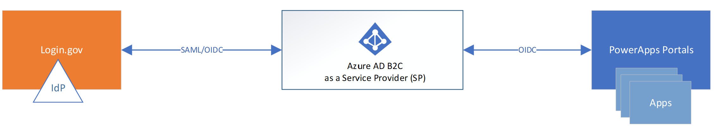

# Login.gov

[Login.gov](https://www.login.gov/) is a trusted, government-issued sign-in service managed by the United States General Services Administration (US, GSA) agency. Login.gov is also a FedRAMP moderate approved multi-factor authentication (MFA) and identity proofing platform. It's used by the public for secure access to US government services.

In this sample tutorial, we will review how to configure Login.gov as an external IdP for Azure Active Directory (AD) B2C tenant by using Identity Experience Framework (IEF)/custom policies. The configuration details are included for both OpenID Connect (OIDC) and SAML protocols.

## Prerequisites

The Login.Gov integration is comprised of the following components:

- **Azure AD B2C tenant** - The authorization server, responsible for verifying the user's credentials using the custom policies defined in the tenant.

- [**Custom policies in Azure AD B2C**](https://docs.microsoft.com/azure/active-directory-b2c/tutorial-create-user-flows?pivots=b2c-custom-policy).

- [**Register a web application**](https://docs.microsoft.com/azure/active-directory-b2c/tutorial-register-applications) and [**enable the ID token implicit
grant**](https://docs.microsoft.com/azure/active-directory-b2c/tutorial-register-applications#enable-id-token-implicit-grant).

- **Login.gov account** - Login.gov provides a [sandbox](https://developers.login.gov/testing/) environment for testing app integration. Review the [developers guide](https://developers.login.gov/overview/). Once you've tested your integration in the sandbox environment, you can request deployment to the Login.gov
[production](https://developers.login.gov/production/) environment.

## Scenario description

Login.gov supports both [SAML](https://developers.login.gov/saml) and [OpenID Connect (OIDC)](https://developers.login.gov/oidc) implementation protocols. It requires token signing and encryption for SAML and private_key_jwt for OIDC.

The diagram shows the implementation. 

## Onboard with Login.gov

### Create an application in Login.gov

[Register an application](https://developers.login.gov/testing/) in the Login.gov sandbox environment, which covers creating an account and an app in the sandbox environment. For the app, the following information is required

- Friendly name
- Team
- Authentication Protocol
  - OpenID Connect
  - SAML
- Issuer
- Public certificate
- Redirect URIs `https://<tenant>.b2clogin.com/<tenant>.onmicrosoft.com/oauth2/authresp` , where `<tenant>` is the Azure AD B2C tenant name
- Attribute bundle (based on IAL level)

Send partner integration testing requests to <partners@login.gov>. Once an account is created, you can sign-in to the partner
dashboard <https://dashboard.int.identitysandbox.gov/>

Production environment is located at <https://secure.login.gov>. For additional details on production environment, go to <https://developers.login.gov/production/>

## Setup Azure AD B2C

You must configure using IEF/custom policies in Azure AD B2C for
integrations that require either SAML or OIDC with private_key_jwt.

### Register an application

1. In your B2C tenant, under **Manage**, select **App
   registrations**> **New registration**.

2. Provide a **Name** for the application and enter your **Redirect URI**. For testing purposes, enter https://jwt.ms.

3. Make sure multi-factor authentication is **Disabled**.

4. Select **Register**.

   a. For testing purposes, select **Authentication**, and under Implicit Grant, select the **Access Tokens** and **ID Tokens** check boxes.

   b. Select **Save**.

### Create a policy key

You need to store the client secret that you previously recorded in your Azure AD B2C tenant.

1. Sign in to the [Azure portal](https://portal.azure.com/).

2. Make sure you\'re using the directory that contains your Azure AD B2C tenant. Select the **Directory + subscription** filter in the top menu and choose the directory that contains your tenant.

3. Choose **All services** in the top-left corner of the Azure portal, and then search for and select **Azure AD B2C**.

4. On the Overview page, select **Identity Experience Framework**.

5. Select **Policy Keys** and then select **Add**.

6. For **Options**, choose Manual.

7. Enter a **Name** for the policy key. For example, LoginGovSecret. The prefix B2C_1A_ is added automatically to the name of your key.

8. In **Secret**, enter your client secret that you previously
   recorded.

9. For **Key usage**, select Signature.

10. Select **Create**.

## Configure using OIDC

### Configure Login.gov as an Identity provider using OIDC

To enable users to sign in using Login.gov account, define
the account as a claims provider that Azure AD B2C can communicate with through an endpoint. The endpoint provides a set of claims that are used by Azure AD B2C to verify that a specific user has authenticated.

You can define a Login.gov account as a claims provider by adding it to the **ClaimsProviders** element in the extension file of your policy.

1. Open the *TrustFrameworkExtensions.xml*.

2. Find the **ClaimsProviders** element. If it doesn't exist, add it under the root element.

3. Add a new [**ClaimsProvider**](https://github.com/azure-ad-b2c/partner-integrations/blob/master/samples/Login.gov/Policies/OIDC/TrustFrameworkExtensions.xml)

>[!NOTE]
>There are 2 TechnicalProfiles defined, one for Identity Assurance Level 1 (IAL1) and another for IAL2.

4. Set client_id to the application ID (issuer) from the application registration.

5. Save the file.

### Add the Authentication Context Class Reference for OIDC

Next, you need an Authentication Context Class Reference (ACR) value for the IAL. Login.gov supports IAL1 and IAL2.

Add the [ACR](https://github.com/azure-ad-b2c/partner-integrations/blob/master/samples/Login.gov/Policies/OIDC/Buildingblock.xml) value to the `ClaimsSchema` element
within `BuildingBlocks`.

### Add a user journey for OIDC

At this point, the identity provider has been set up, but it's not yet available in any of the sign-in pages. If you don't have your own custom user journey, create a duplicate of an existing template user journey, otherwise continue to the next step.

1. Open the *TrustFrameworkBase.xml* file from the starter pack.

2. Find and copy the entire contents of the **UserJourney** element that includes Id="SignUpOrSignIn".

3. Open the *TrustFrameworkExtensions.xml* and find
   the **UserJourneys** element. If the element doesn't exist, add one.

4. Paste the entire content of the **UserJourney** element that you copied as a child of the **UserJourneys** element.

5. Rename the Id of the user journey. For example, Id="SuSiLoginGovOidc".

### Add the identity provider to a user journey

Now that you have a user journey, add the new identity provider to the user journey. You first add a sign-in button, then link the button to an action. The action is the technical profile you created earlier.

1. Find the orchestration step element that includes Type="CombinedSignInAndSignUp",  or Type="ClaimsProviderSelection" in the user journey. It's
usually the first orchestration step.
The **ClaimsProviderSelections** element contains a list of identity providers that a user can sign in with. The order of the elements controls the order of the sign-in buttons presented to the user. Add a **ClaimsProviderSelection** XML element. Set the value of **TargetClaimsExchangeId** to a friendly name.

2. In the next orchestration step, add a **ClaimsExchange** element. Set the **Id** to the value of the target claims exchange Id. Update the value of **TechnicalProfileReferenceId** to the Id of the     technical profile you created earlier.

The [XML](https://github.com/azure-ad-b2c/partner-integrations/blob/master/samples/Login.gov/Policies/OIDC/UserJourney.xml) demonstrates the first two orchestration steps of a user journey with the identity provider.

### Configure the relying party policy using OIDC

The relying party policy, for
example [SignUpSignIn.xml](https://github.com/Azure-Samples/active-directory-b2c-custom-policy-starterpack/blob/master/SocialAndLocalAccounts/SignUpOrSignin.xml),
specifies the user journey which Azure AD B2C will execute. Find
the **DefaultUserJourney** element within [relying
party](https://docs.microsoft.com/azure/active-directory-b2c/relyingparty). Update the **ReferenceId** to match the user journey ID, in which you added the identity provider.

In the [example](https://github.com/azure-ad-b2c/partner-integrations/blob/master/samples/Login.gov/Policies/OIDC/SignupSignin.xml), for the SignUpOrSignIn user journey,
the **ReferenceId** is set to SignUpOrSignIn.

## Configure using SAML

### Configure Login.gov as an Identity provider using SAML

To enable users to sign in using Login.gov account, you need to define the account as a claims provider that Azure AD B2C can communicate with through an endpoint. The endpoint provides a set of claims that are used by Azure AD B2C to verify a specific user has authenticated.

You can define a Login.gov account as a claims provider by adding it to the **ClaimsProviders** element in the extension file of your policy.

1. Open the *TrustFrameworkExtensions.xml*.

2. Find the **ClaimsProviders** element. If it does not exist, add it under the root element.

3. Add a new [**ClaimsProvider**](https://github.com/azure-ad-b2c/partner-integrations/blob/master/samples/Login.gov/Policies/SAML/TrustFrameworkExtensions.xml).

>[!Note]
>There is 1 TechnicalProfile defined for IAL2.

4. Set client_id to the application ID from the application
registration.

5. Save the file.

### Add the ACR for SAML

You'll need an acr value specified for the set of claims attributes to be included based on the Identity Assurance Level (IAL). Login.gov supports IAL1 and IAL2. Here is an [example](https://github.com/azure-ad-b2c/partner-integrations/blob/master/samples/Login.gov/Policies/SAML/Buildingblock.xml) for IAL2 that is included in the `Metadata` element within the `TechnicalProfile`.

>[!NOTE]
>The requested attributes are separated by space (+).

### Add a user journey for SAML

At this point, the identity provider has been set up, but it's not yet available in any of the sign-in pages. If you don't have your own custom user journey, create a duplicate of an existing template user journey, otherwise continue to the next step.

1. Open the *TrustFrameworkBase.xml* file from the starter pack.

2. Find and copy the entire contents of the **UserJourney** element
that includes Id="SignUpOrSignIn".

3. Open the *TrustFrameworkExtensions.xml* and find
   the **UserJourneys** element. If the element doesn't exist, add one.

4. Paste the entire content of the **UserJourney** element that you copied as a child of the **UserJourneys** element.

5. Rename the Id of the user journey. For
    example, Id="SuSiLoginGovSaml".

### Add the identity provider to a user journey for SAML

Now that you have a user journey, add the new identity provider to the user journey. You first add a sign-in button, then link the button to an action. The action is the technical profile you created earlier.

1. Find the orchestration step element that   includes Type="CombinedSignInAndSignUp",
    or Type="ClaimsProviderSelection" in the user journey. It's
    usually the first orchestration step.
    The **ClaimsProviderSelections** element contains a list of identity providers that a user can sign in with. The order of the elements controls the order of the sign-in buttons presented to the user. Add a **ClaimsProviderSelection** XML element. Set the value of **TargetClaimsExchangeId** to a friendly name.

2. In the next orchestration step, add a **ClaimsExchange** element. Set the **Id** to the value of the target claims exchange Id. Update the value of **TechnicalProfileReferenceId** to the Id of the
technical profile you created earlier.

The [XML](https://github.com/azure-ad-b2c/partner-integrations/blob/master/samples/Login.gov/Policies/SAML/UserJourney.xml) demonstrates the first two orchestration steps of a user journey with the identity provider.

### Configure the relying party policy using SAML

The relying party policy, for
example [SignUpSignIn.xml](https://github.com/Azure-Samples/active-directory-b2c-custom-policy-starterpack/blob/master/SocialAndLocalAccounts/SignUpOrSignin.xml),
specifies the user journey which Azure AD B2C will execute. Find
the **DefaultUserJourney** element within [relying
party](https://docs.microsoft.com/azure/active-directory-b2c/relyingparty). Update the **ReferenceId** to match the user journey ID, in which you added the identity provider.

In the provided [example](https://github.com/azure-ad-b2c/partner-integrations/blob/master/samples/Login.gov/Policies/SAML/SignupSignin.xml), for the SignUpOrSignIn user journey, the **ReferenceId** is set to SignUpOrSignIn:

## Upload the custom policy

1. Sign in to the [Azure portal](https://portal.azure.com/).

2. Select the **Directory + Subscription** icon in the portal toolbar, and then select the directory that contains your Azure AD B2C tenant.

3. In the Azure portal, search for and select **Azure AD B2C**.

4. Under **Policies**, select **Identity Experience Framework**.

5. Select **Upload Custom Policy**, and then upload the two policy files that you changed, in the following order:

   - The extension policy, for example TrustFrameworkExtensions.xml
   - Then the relying party policy, such as SuSiLoginGovOidc.xml.

## Test the user flow

In your Azure AD B2C tenant, under Policies select **User flows**.

1. Select your previously created user flow.

2. Select **Run user flow**.

    a.  Application: select the **registered app**

    b.  Reply URL: select the **redirect URL**

You will be redirected to Login.gov site for authentication. Refer to Login.gov documentation for more information.
