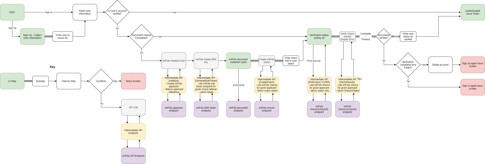

# Introduction

OnFido is a Document ID and facial biometrics verification SaaS that
allows companies to meet “Know Your Customer” and Identity requirements
in real time. Here, we are integrating and hosting the OnFido document
client within Azure AD B2C as well as performing basic document and
biometric facial verification with the help of an intermediate API
service.

# Solution Components

This verification solution comprises the following components:

  - **Azure AD B2C Tenant**: The Identity Provider (IdP), performs user
    verification based on custom policies defined in the tenant. Also
    hosts the OnFido client app which collects the user documents and
    transmits it to the OnFido API service

  - **OnFido Client**: A configurable javascript client document
    collection utility that can be deployed within other webpages.
    Collects the documents and performs preliminary checks (document
    size, quality etc…)

  - **RESTful Intermediate API**: Provides endpoints for the B2C Tenant
    to communicate with the OnFido API service, handling data processing
    and adhering to the security requirements of both.

  - **OnFido API Service**: The backend service provided by OnFido which
    saves and verifies the documents provided by the user.

## Workflow

OnFido process flow

## Setting Up the Solution

### Get an OnFido account

Get an account with OnFido and create an API key. Live keys are
billable, but you can use sandbox keys for trying out the solution. They
produce the same result structure as live keys, but the results are
always predetermined. Documents are not really processed or saved. Make
a note of the key. We will need it later

### Deploy the API

Deploy the provided API code to an Azure service. The code can be
published from Visual Studio, following
these [instructions](https://docs.microsoft.com/visualstudio/deployment/quickstart-deploy-to-azure?view=vs-2019).

Set-up CORS, add Allowed Origin `https://{your_tenant_name}.b2clogin.com`

Note the URL of the deployed service. We will need this later to
configure this later to configure Azure AD with the required settings.

#### Adding sensitive configuration settings

Application settings can be [configured in the App service in
Azure](https://docs.microsoft.com/en-us/azure/app-service/configure-common#configure-app-settings).
This allows for settings to be securely configured without checking them
into a repository. The Rest API needs the following settings provided:

| **Application Setting Name** | **Source**     | **Notes** |
| ---------------------------- | -------------- | --------- |
| OnfidoSettings:AuthToken     | OnFido Account |           |

### Deploy the UI

Set up a [blob storage container in your storage
account](https://docs.microsoft.com/en-us/azure/storage/blobs/storage-quickstart-blobs-portal#create-a-container) .

Find the UI files from the **UI** folder and store them into your blob
container.

Set-up CORS

- Allowed Origin: `https://{your_tenant_name}.b2clogin.com`
- Allowed Methods: `GET` and `PUT`

#### Update UI Files

In the UI Files, go to the folder **ocean\_blue**

Open each html file.

Find & replace **{your-ui-blob-container-url}** with the URL of where
your UI “ocean\_blue”, “dist” and “assets” folders are located

Find & replace **{your-intermediate-api-url}** with the Url of the
intermediate API app service.

### Azure AD B2C Configuration

#### Register Identity Experience Framework applications
Follow [this documentation](https://docs.microsoft.com/en-us/azure/active-directory-b2c/custom-policy-get-started?tabs=applications#register-identity-experience-framework-applications) to create the 2 App Registrations `IdentityExperienceFramework` and `ProxyIdentityExperienceFramework`.

Note down the Application IDs of both app registrations.

#### Update the Policy files, replace the configuration values

In the provided custom policies, find the following placeholders and
replace with the corresponding values from your instance

Placeholder| Replace with | Example
-----------|--------------|--------------
{your_tenant_name}|Your tenant short name|“yourtenant” from yourtenant.onmicrosoft.com
{your_tenantId}|Tenant Id of your B2C tenant|01234567-89ab-cdef-0123-456789abcdef
{your_tenant_IdentityExperienceFramework_appid}|App Id of the IdentityExperienceFramework app configured in your B2C tenant, created in the previous step|01234567-89ab-cdef-0123-456789abcdef
{your_tenant_ ProxyIdentityExperienceFramework _appid}|App Id of the ProxyIdentityExperienceFramework app configured in your B2C tenant, created in the previous step|01234567-89ab-cdef-0123-456789abcdef
{your_tenant_extensions_appid}|App Id of your tenant’s storage application|01234567-89ab-cdef-0123-456789abcdef
{your_tenant_extensions_app_objectid}|Object Id of your tenant’s storage application|01234567-89ab-cdef-0123-456789abcdef
{your_app_insights_instrumentation_key}|Instrumentation key of your app insights instance*|01234567-89ab-cdef-0123-456789abcdef
{your_ui_file_base_url}|URL of where your UI “ocean_blue”, “dist” and “assets” folders are located|https://yourstorage.blob.core.windows.net/UI/
{your_app_service_url}|URL of your app service|https://yourapp.azurewebsites.net

\*App insights can be in a different tenant. This step is optional.
Remove the corresponding TechnicalProfiles and OrchestrationSteps if
not needed

#### Upload and test the custom B2C policies

Upload and test the policies according to the instructions in [this
documentation.](https://docs.microsoft.com/en-us/azure/active-directory-b2c/custom-policy-get-started?tabs=applications#custom-policy-starter-pack)  Use the policy files in this package instead of the ones mentioned in the documentation.

### Notes

This sample policy is based on [LocalAccounts starter
pack](https://github.com/Azure-Samples/active-directory-b2c-custom-policy-starterpack/tree/master/LocalAccounts)